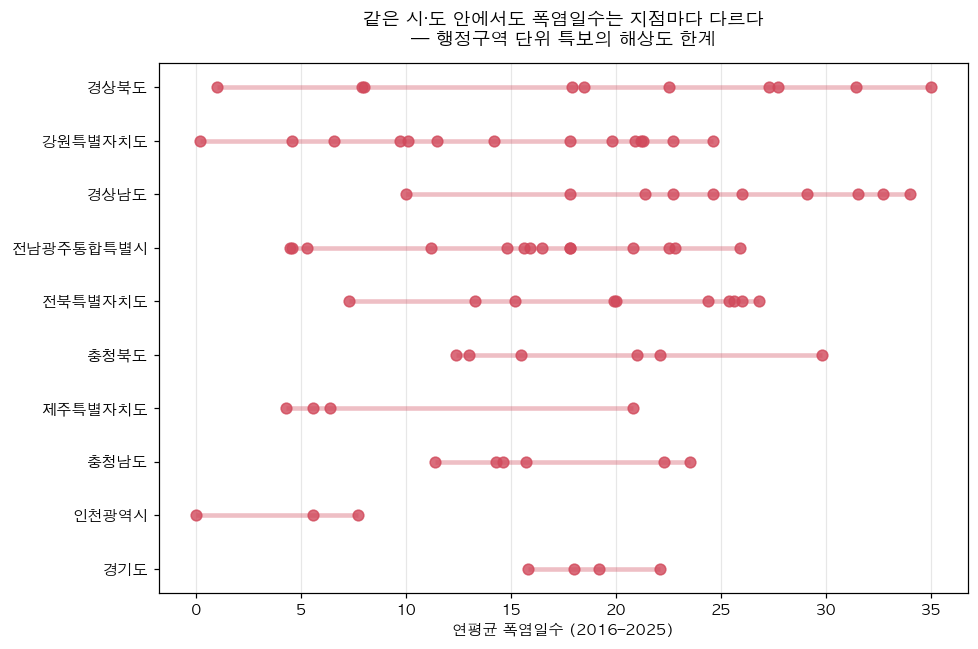
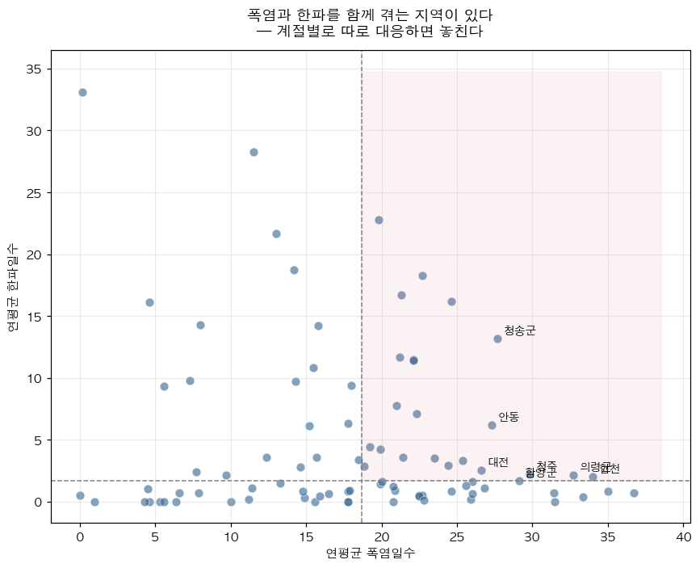
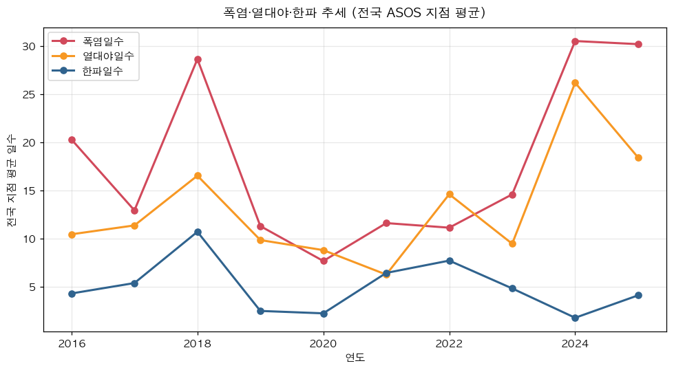

# 쉼길 — 주소로 계산하는 사계절 기후취약 대응 플랫폼

### 부제 : 격자에서 호(戶)까지

**2026년 주소정보 활용 대국민 공모전 / 정책 아이디어 분야**

---

## 1. 제안 요약

기상 정보는 **격자**로 생산되고, 재난 특보는 **행정구역**으로 발령되며, 취약계층 통계는 **5년 주기**로 집계된다. 그러나 폭염과 한파로 사람이 쓰러지는 곳은 격자도 행정구역도 아닌 **"○○로 25, 지하 101호"이고 "면 단위 밭 한가운데"다.**

무더위쉼터는 전국에 5만 개소가 넘는다. 그런데도 2025년 온열질환자는 4,460명, 추정 사망자는 29명이었다. **쉼터가 부족해서가 아니라, 있어도 갈 수 없기 때문이다.**

「쉼길」은 **주소정보를 기상재난 대응의 공간 기준자(spatial key)로 삼아**, *쉼터가 어디에 있나*가 아니라 ***여기서 갈 수 있나***를 계산하는 플랫폼이다. 두 가지가 이 서비스를 기존 쉼터 안내 서비스와 가른다.

1. **열노출 가중거리(HWD)** — 직선거리도 도로거리도 아닌, "얼마나 뙤약볕을 걷는가". 겨울에는 계수만 뒤집어 **사계절 단일 엔진**으로 쓴다.
2. **호(戶) 단위 취약도** — 상세주소DB의 `지하 101호`·`옥탑` 정보로, **복지 등록 여부와 무관하게** 취약 주거를 전수 포착한다.

시민앱·지자체 콘솔·자동알림 세 화면이 하나의 엔진을 공유하고, 시민 후기가 공공데이터를 되돌려 고치는 피드백 루프로 닫힌다.

> **한 줄 요약** — 기상청은 격자를 주고, 행안부는 주소를 준다. 둘을 잇는 순간 "우리 동네 폭염"이 "우리 집 폭염"이 된다.

---

## 2. 문제 정의

### 2-1. 해상도의 불일치

| 구분 | 현재 생산 단위 | 실제 피해 발생 단위 |
|---|---|---|
| 기상 예보 | 5km 격자 | 골목·건물 |
| 폭염·한파 특보 | 시·군·구 | 세대(호) |
| 취약계층 통계 | 행정구역 / 5년 주기 | 개별 가구 |
| 재난 문자 | 기지국 반경 | 수신자 거주지 |

네 층위가 모두 어긋나 있다. 그 결과 **폭염경보는 시 전체에 울리지만, 정작 방문해야 할 집은 특정되지 않는다.**

### 2-2. 근거 ① — 같은 특보구역 안에서도 폭염은 다르게 온다

기상자료개방포털의 전국 종관기상관측(ASOS) 98개 지점별 폭염일수를 2016–2025년 10년간 집계했다. 결과는 명확하다.

- 관측지점이 3곳 이상인 **10개 시·도의 내부 격차는 평균 18.3일**
- **경상북도는 같은 도 안에서 1.0일 ~ 35.0일, 격차 34.0일**
- 강원 24.4일, 경남 24.0일, 전남·광주 21.4일

더 결정적인 것은 **시·도로 묶어도 편차가 거의 줄지 않는다**는 점이다.

| 구분 | 폭염일수 표준편차 |
|---|---|
| 전국 98개 지점 전체 | 8.6일 |
| 시·도 내부 (지점 3곳 이상 시·도 평균) | 6.6일 |

시·도로 묶어서 **줄어드는 편차는 24%뿐이고, 76%는 그대로 남는다.**

즉, 시·군·구 단위로 일괄 발령되는 특보는 **같은 구역 안의 실제 위험 편차를 담지 못한다.** 행정구역은 행정 편의의 단위이지, 위험의 단위가 아니다.



*시·도별로 소속 관측지점의 연평균 폭염일수를 늘어놓은 것. 점이 넓게 흩어진 시·도일수록 하나의 특보로 묶어 대응하기 어렵다.*

### 2-2-1. 낮의 폭염과 밤의 폭염은 서로 다른 곳에서 일어난다

같은 자료로 폭염일수와 열대야일수의 상관을 구하면 **상관계수 -0.01 — 사실상 무관**하다.

- 서귀포: 폭염일수 **6.4일**인데 열대야 **43.9일**
- 제주: 폭염일수 20.8일, 열대야 **50.6일** (전국 최다)
- 반대로 내륙 분지는 폭염일수가 높아도 밤에는 식는다

해안·도서와 내륙이 정반대 패턴을 보이며 상쇄된 결과다. 이것이 뜻하는 바는 무겁다 — **낮 최고기온으로 발령되는 폭염특보는 야간 위험을 예측하지 못한다.**

그런데 낮 더위는 그늘과 쉼터로 피할 수 있지만, **열대야는 집에서 겪는다.** 야간 위험을 결정하는 것은 기온이 아니라 **어떤 집에 사는가**이며, 그것은 기상 데이터가 아니라 **주소가 아는 정보**다.

### 2-2-2. 폭염과 한파를 함께 겪는 지역이 있다

분석 대상 86개 지점 중 **23개(27%)**가 폭염일수·한파일수 모두 중앙값을 넘었다. 정선군·홍천·청송군 등 내륙 산간이 대표적이다. 폭염 대책과 한파 대책이 별도 사업·별도 예산·별도 명부로 운영되는 현재 구조에서, **이 지역 주민은 1년에 두 번 사각지대에 놓인다.**



덧붙여, 전국 지점 평균 폭염일수는 **2024년 30.5일, 2025년 30.2일**로 최근 10년 중 최고 수준을 2년 연속 기록했다(직전 최고는 2018년 28.6일). 특히 **열대야일수는 2024년 26.2일**로, 10년 평균(13.2일)의 두 배에 달했다. **밤에 식지 않는 여름이 일상이 되고 있는데, 대응 해상도는 그대로다.**



### 2-3. 근거 ② — 온열질환의 절반 가까이는 '주소가 없는 곳'에서 발생한다

질병관리청 온열질환 응급실감시체계에 따르면 **2025년 온열질환자는 4,460명, 추정 사망자는 29명**이었다. 발생 장소는 **실외가 79.2%**이며, 그중

- **실외 작업장 1,431명 (32.1%)**
- **논밭 542명 (12.2%)**
- 길가 522명 (11.7%)

**실외작업장과 논밭을 합치면 44.3%.** 이곳들의 공통점은 **도로명주소가 없거나 무의미하다**는 것이다. 쓰러진 사람이 119에 위치를 설명할 방법이 없다. 직업별로도 단순노무종사자 26%, 농림어업종사자 7.8%로 **야외 노동 현장이 핵심 위험지대**임이 확인된다.

### 2-4. 근거 ③ — 취약 주거를 파악할 공식 데이터가 없다

- 서울연구원 「서울시 반지하주택 유형과 침수위험 해소방안」은 **건축물대장 자료의 비체계성·부정확성·오류·누락 때문에, 현장조사 없이 대장자료만으로 주거용 지하층을 식별하고 호수를 정확히 계산하는 것은 사실상 불가능**하다고 명시한다. 현행 반지하 통계는 **모두 개략적 추정치**다.
- KOSIS의 「거주층별 가구(일반가구)-시군구」 통계표(DT_1PE1508)는 **2015년 단일 시점** 자료다.
- 2020년 인구주택총조사의 반지하 가구 수(32만 7천 가구)는 **표본조사 결과**였고, **등록센서스 방식의 반지하·옥탑 통계는 2024년에야 처음 공표**되었다. 그마저도 연 1회, 행정구역 단위다.

정리하면 — **폭염·한파에 가장 취약한 주거 형태를, 국가는 실시간으로도 세대 단위로도 알지 못한다.**

### 2-5. 그런데 주소에는 이미 적혀 있다

행정안전부가 시행 중인 **상세주소 부여 제도**는 2가구 이상이 거주하는 **원룸·다가구·단독주택에 동·층·호를 부여**한다. 즉 상세주소DB에는 `지하 1층 101호`, `옥탑` 같은 **거주 층 정보가 이미 구조화된 형태로 들어 있다.**

건축물대장이 못 하는 일을, 주소가 이미 하고 있다. 다만 **아무도 이것을 재난 대응에 쓰고 있지 않을 뿐이다.**

---

## 3. 제안 내용 — 「쉼길」

### 3-0. 무엇을 만드는가

> **쉼터는 이미 전국에 5만 개소가 넘는다. 그런데도 사람이 죽는다.**
> 쉼길은 *어디에 있나*가 아니라 ***여기서 갈 수 있나*** 를 주소로 계산하는 플랫폼이다.

쉼터가 있는데도 피해가 반복되는 이유는 부족해서가 아니라 **네 개의 단절** 때문이다.

| 단절 | 실제 상황 | 지금까지의 대응 | 무엇이 빠졌나 |
|---|---|---|---|
| ① 모른다 | 우리 동네 쉼터가 어딘지 모른다 | 홈페이지에 목록 게시 | 내 주소 기준 안내가 없다 |
| ② 못 간다 | 400m인데 전부 뙤약볕이다 | 직선거리로 "가깝다"고 판정 | **가는 길의 열노출**을 아무도 안 센다 |
| ③ 닫혀 있다 | 갔더니 문이 잠겨 있다 | 월 1회 갱신 운영정보 | 현장 실황 피드백 경로가 없다 |
| ④ 못 걷는다 | 85세, 지하 101호, 계단 12개 | 행정동 단위 취약계층 명부 | **누가 어느 층에 사는지** 모른다 |

**네 단절의 해법이 모두 주소다.** ①은 지오코딩, ②는 실내이동경로, ③은 사물주소와 피드백, ④는 상세주소다.

---

### 3-1. 핵심 발명 ① — 열노출 가중거리 (HWD)

**직선거리도 도로거리도 아니다. "얼마나 뙤약볕을 걷는가"다.**

```
HWD = Σ (구간거리 × 열노출계수 × 보행부담계수)
```

| 계수 | 산출 근거 | 활용 데이터 |
|---|---|---|
| 열노출계수 | 그늘 없는 구간에 가중, 지하연계·실내구간은 0.3배 | 건물DB(층수→그림자), 실내이동경로 |
| 보행부담계수 | 경사·계단·횡단보도 대기 | 보행자도로, 지하철 출입구 |

그늘 없는 400m가 지하상가를 지나는 800m보다 위험하다. 현재 모든 쉼터 안내는 직선거리 기준이므로, **"행정구역상 커버되는데 실제로는 갈 수 없는 곳"이 통계에서 사라진다.** HWD로 다시 계산하면 사각지대의 정의 자체가 바뀐다.

**겨울에는 계수만 뒤집는다.** 열노출 → 체감풍속, 쿨링루트 → 웜루트. **같은 엔진으로 사계절을 쓴다.**

### 3-2. 핵심 발명 ② — 호(戶) 단위 취약도

기존 취약계층 파악은 **행정동 단위 통계** 또는 **복지 등록 명부**에 의존한다. 둘 다 샌다.

- 행정동 단위 → 2-2에서 확인했듯 같은 시·도 안에서도 폭염일수가 34일 갈린다. 행정동은 위험의 단위가 아니다
- 등록 명부 → 등록하지 않은 사람은 존재하지 않는 것이 된다

**상세주소DB는 `지하 1층 101호`·`옥탑`을 등록 여부와 무관하게 전수 보유한다.**

> 취약계층을 **찾아 등록하는** 방식에서, **주소가 이미 아는 것을 쓰는** 방식으로.

---

### 3-3. 서비스 구조

```
┌─────────────┬──────────────┬──────────────┐
│  A. 시민앱   │ B. 지자체콘솔 │  C. 자동알림  │
│  "갈 수      │  "어디가     │  "지금 당신   │
│   있나?"     │   비었나?"   │   위험하다"   │
└──────┬──────┴──────┬───────┴──────┬───────┘
       └─────────────┼──────────────┘
                     ▼
          ┌────────────────────┐
          │     쉼길 엔진       │
          │  주소 → HWD → 쉼터  │
          └─────────┬──────────┘
                    ▼
   주소정보: 상세주소DB · 건물DB · 사물주소 · 국가지점번호 · 실내이동경로
   기 상 : 격자예보 · 특보 · 주소정보시설 센서
   시 설 : 무더위/한파쉼터 표준데이터
                    ▲
          ┌─────────┴──────────┐
          │  D. 피드백 루프      │
          │ 시민 후기 → 데이터 교정│
          └────────────────────┘
```

---

### A. 시민앱 — "여기서 갈 수 있나?"

주소 한 줄을 넣으면 계절을 자동 판별해 해당 계절의 시설로 전환한다.

| 계절 | 시설 유형 | 경로 모드 |
|---|---|---|
| 여름 | 무더위쉼터 | 쿨링루트 (그늘·실내 우선) |
| 겨울 | 한파쉼터 | 웜루트 (방풍·실내 우선) |
| 봄·가을 | 미세먼지 대피시설 | 실내 연결 우선 |

- 결과가 **"1.2km"가 아니라 "그늘로 8분"**으로 표시된다
- 도착지 표기가 **사물주소**다 — `○○로 25 앞 그늘막`. 건물 중심 좌표가 아니라 **입구까지** 안내한다. 고령자에게 필요한 것은 좌표가 아니라 진입점이다
- 지금 **운영 중**인 곳만 보여준다

### B. 지자체 콘솔 — "어디가 비었나?"

담당 공무원용 정책 도구.

**B-1. 사각지대 지도** — HWD 기준 도보 10분을 초과하는 구역을 표시한다. 직선거리 기준 지도와 **나란히** 보여주는 것이 핵심이다. 두 지도의 차이가 곧 *지금까지 놓치고 있던 곳*이다.

**B-2. 취약세대 레이어** — 상세주소 기반 지하·옥탑 세대를 겹친다. **"사각지대 ∩ 지하 세대"**가 최우선 대응 대상이며, 이것이 이 서비스의 결정적 출력이다.

**B-3. 신규 쉼터 입지 추천** — 커버리지 최대화 문제로 푼다. 후보지는 새로 짓는 곳이 아니라 **건물DB에서 추출한 유휴 공공건물**이다. 목적함수는 *신규 1개소 설치 시 사각지대에서 벗어나는 취약세대 수*.

**B-4. 방문점검 우선순위 명부** — 대책기간 중 실제로 문을 두드릴 순서를 자동 생성한다.

**B-5. 검증 레이어** — 119 온열·한랭질환 신고 주소를 겹쳐, 사각지대 예측이 실제 발생과 맞았는지 사후 검증한다. **모델이 맞았는지 확인하는 구조를 처음부터 넣는다.**

### C. 자동 알림 — "지금 당신이 위험하다"

```
[폭염경보] 김○○님 댁(○○로 25, 지하 101호)에서
그늘길로 6분 거리에 ○○경로당 쉼터가 운영 중입니다.
· 위치: ○○로 25 맞은편 (정문 우측)
· 운영: 09–18시 / 에어컨 있음 / 현재 여유
```

- 대상 선정이 **등록 명부가 아니라 상세주소 기반**이다 → 미등록 취약세대까지 포착
- 거리가 **HWD**다 → "200m"라 안내해놓고 실제로는 못 가는 일이 없다
- 위치가 **사물주소**다 → 시설명만 주는 현재 재난문자와 다르다

**야외 확장** — 논밭·실외작업장에는 도로명주소가 없는데, 온열질환의 **44.3%가 그곳에서 발생한다**(2-3). 이 구역은 **국가지점번호** 단위로 경보를 보내고, 119 신고 시 지점번호를 자동 첨부하며, 쉼터 대신 **이동식 그늘막 배치 좌표**를 안내한다.

**알림 정밀도** — 도로명판·건물번호판 등 **주소정보시설에 저가 온습도 센서를 부착**하면 골목 단위 실측이 가능해진다. 이 시설물들은 위치가 이미 법적으로 특정된 채 전국에 설치되어 있어, 신규 부지·측위·설치가 전부 불필요하다. 기존 정비 물량에 얹는 방식이라 별도 예산 요구가 최소화된다. 2-2에서 확인한 시·도 내부 34일의 격차는, 관측점이 시·군에 하나뿐이라서 생기는 문제이기도 하다.

### D. 피드백 루프 — 후기가 데이터를 고친다

시민 후기를 별점으로 끝내지 않고 **공공데이터 교정 신호**로 쓴다.

| 시민 입력 | 시스템 동작 |
|---|---|
| "문이 잠겨 있었어요" | 운영정보 오류 플래그 → 지자체 확인 요청 |
| "입구를 못 찾았어요" | 사물주소·출입구 좌표 보정 대상 등록 |
| "사람이 너무 많아요" | 실시간 혼잡도 반영 → 대안 추천 |
| "에어컨이 없어요" | 표준데이터 속성 검증 요청 |

**월 1회 갱신되던 공공데이터가 상시 갱신 체계로 바뀐다.** 서비스가 데이터를 쓰기만 하는 것이 아니라 **품질을 되돌려주는** 구조다.

---

## 4. 기대효과

**정책 해상도의 전환** — "시 전체 폭염경보"에서 **"갈 수 없는 세대 명부"**로. 자원을 뿌리는 방식에서 **겨누는 방식**으로 바뀐다.

**사각지대의 재정의** — 직선거리로는 커버되는데 HWD로는 아닌 곳. 지금까지 통계에 잡히지 않던 집단이 처음 드러난다.

**두 종류의 사각지대 해소** — 건축물대장이 못 잡는 반지하(3-2), 도로명주소가 없는 야외(C). 현행 체계가 구조적으로 놓치는 두 집단을 주소정보로 포착한다.

**기존 자산의 재활용** — 쉼터는 이미 있고, 상세주소 부여 사업은 진행 중이며, 주소정보시설은 이미 설치돼 있다. **새로 짓는 것보다 잇는 것이 많다.**

**사계절 단일 엔진** — 여름 투자가 겨울에 그대로 재사용된다.

**데이터 품질의 선순환** — 피드백 루프가 공공데이터를 상시 갱신한다.

**주소정보의 활용 영역 확장** — 주소를 '찾아가는 수단'에서 **'위험을 계산하는 기준자'**로 격상시킨다. 감염병·대기질·침수로 동일 구조를 확장할 수 있다.

---

## 5. 단계별 실행방안

| 단계 | 범위 | 산출물 | 검증 지표 |
|---|---|---|---|
| **MVP** | 서울 1개 자치구, 여름 | 사각지대 지도 (직선거리 vs HWD 비교) | 두 지도의 차이 = 신규 발견 사각지대 수 |
| 1차 | 서울 전역, 사계절 | 시민앱 + 지자체 콘솔 | 쉼터 도달 소요시간 중앙값 |
| 2차 | 광역시 확산 | 자동 알림 + 피드백 루프 | 알림 수신 세대의 쉼터 이용률 |
| 3차 | 전국 + 야외(국가지점번호) | 입지 최적화 도구 | 신규 쉼터당 커버 취약세대 증가분 |

**MVP의 결정적 산출물 한 장**

> *"○○구 지하 거주 세대 중, 폭염 시 도보 10분 내 쉼터에 실제로는 갈 수 없는 세대 N곳"*

직선거리로는 커버된다고 나오지만 HWD로는 아닌 곳. **이 지도 한 장이 제안 전체를 증명한다.**

**추진 주체** — 행정안전부(주소정보) × 기상청(격자·특보) × 지자체(쉼터 운영·현장 대응) × LX(데이터 연계)

**선결 과제** — 기상청 격자 좌표계와 주소정보 좌표계의 표준 매핑 규칙 정립, 상세주소 부여율 제고, 쉼터 사물주소 부여

---

## 6. 활용 주소정보

| 데이터 | 활용처 | 없으면 어떻게 되나 |
|---|---|---|
| 상세주소DB (동·층·호) | B-2 취약세대, C 알림 대상 | 누가 지하에 사는지 알 수 없다 |
| 건물 출입구·실내이동경로 | 엔진 HWD, A 도착안내 | 그늘길 계산이 불가능하다 |
| 사물주소 | A·C 도착지 표기 | 쉼터 입구를 특정할 수 없다 |
| 국가지점번호 | C 야외 확장 | 온열질환 44.3%가 발생하는 구역을 못 다룬다 |
| 도로명주소 건물DB | B-3 유휴건물, 그림자 추정 | 입지 후보를 찾을 수 없다 |
| 주소정보시설 | C 알림 정밀도 | 골목 단위 실측이 불가능하다 |

**어느 하나도 다른 데이터로 대체되지 않는다.** 주소정보가 빠지면 서비스가 성립하지 않는다.

**연계 데이터** — 무더위·한파쉼터 표준데이터, 기상청 격자예보·특보·ASOS 관측, 질병관리청 온열질환 응급실감시체계

---


## 7. 참고자료

- 기상청 기상자료개방포털, 「기상현상일수: 폭염일수·열대야일수·한파일수」 (전국 ASOS 지점, 2016–2026)
- 질병관리청, 「온열질환 응급실감시체계 운영결과」 (2025년 온열질환자 4,460명, 추정사망 29명)
- 서울연구원, 「서울시 반지하주택 유형과 침수위험 해소방안」 — 건축물대장 기반 식별의 한계
- 국가데이터처 KOSIS, 「거주층별 가구(일반가구)-시군구」 (DT_1PE1508, 2015)
- 통계청, 「2024년 인구주택총조사(등록센서스)」 — 반지하·옥탑 가구 최초 공표
- 행정안전부, 상세주소 부여 제도 안내

**분석 재현** — 본 제안서 2-2의 모든 수치는 첨부 노트북 `분석_폭염한파_해상도.ipynb`에서 재현 가능하다. 수집 스크립트 `collect_kma.py`는 API키·로그인 없이 기상자료개방포털 공개 엔드포인트를 사용하므로 누구나 동일한 결과를 확인할 수 있다.
